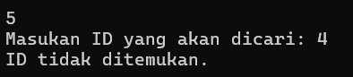
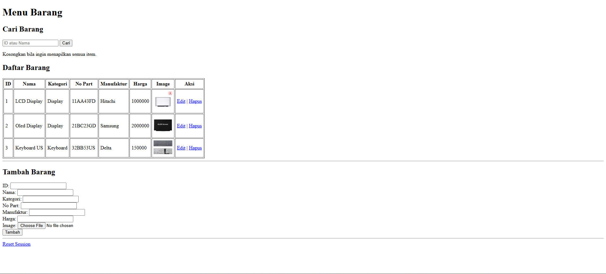
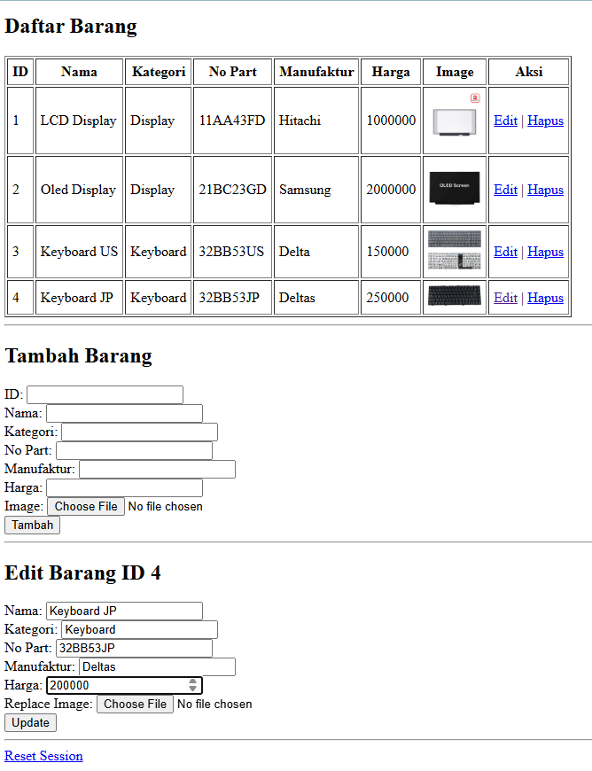

# Tugas Praktikum 1
## Janji
Saya Muhammad Attala Rafikasya dengan NIM 2403310 mengerjakan Tugas Praktikum 1 dalam mata kuliah Desain Pemrograman Berbasis Objek untuk keberkahanNya maka saya tidak melakukan kecurangan seperti yang telah dispesifikasikan.

## Desain Program
Toko Elektronik Part Laptop  
Program ini adalah program manajemen barang sederhana yang memiliki fitur CRUD.

kelas Barang
Atribut Private :
- id : ID unik dalam program.
- nama : Nama produk.
- kategori : Kategori barang.
- no_part : No part .
- manufaktur : Manufaktur Barang.
- harga : Harga jual barang.
- foto (Hanya php) : Gambar dari produk.

Method :
- Get Set untuk semua private atribut

# Alur Program
Ketika dijalankan program akan memberikan menu pilihan kepada user seperti berikut.

## Operasi  
### 1. Tampilkan Semua Data.
Jika user memilih 1, maka program akan menampilkan seluruh data yang ada.

### 2. Menambahkan Data.
Jika user memilih 2, maka program akan meminta input kepada user berupa semua atribut dari kelas Barang.  

### 3. Update Data.
Jika user memilih 3, maka program akan meminta input kepada user untuk id yang akan diubah.

- Jika data ditemukan  
Maka user akan diminta memasukan input untuk setiap atribut Barang. Jika atribut tidak ingin dirubah cukup kosongkan input lalu klik enter, jika berupa int seperti harga maka cukup di beri 0.  

- Jika data tidak ditemukan  
Maka akan ada pemberitahuan bahwa id yang dicari tidak ada.  

### 4. Hapus Data
Jika user memilih 4, maka program akan meminta input kepada user untuk id yang akan dihapus.  

- Jika data ditemukan  
Maka data akan di hapus dari list barang.  

- Jika data tidak ditemukan  
Maka akan ada pemberitahuan bahwa id yang akan dihapus tidak ada.  

### 5. Cari Data
Jika user memilih 5, maka program akan meminta input kepada user untuk id yang akan di cari.  

- Jika data ditemukan  
Maka data akan ditampilkan kepada user  

- Jika data tidak ditemukan  
Maka akan ada pemberitahuan bahwa id yang dicari tidak ditemukan.  

### 6. Akhiri Program
Jika user memilih 6, maka program akan berhenti berjalan.  

## Dokumentasi
### Dokumentasi C++

### Dokumentasi Java

### Dokumentasi Python

### Dokumentasi PHP
#### Read  

#### Add  
  

#### Edit

#### Hapus

